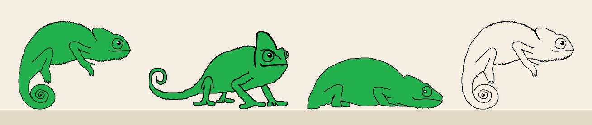

# 🦎 Chameleon Desktop Pet

A hand-drawn chameleon that lives at the bottom of your screen. It hops around, sleeps,
catches your cursor with its tongue, and can camouflage itself so it's never in your way.

Works on **Windows, macOS and Linux**. Made for [Hack Club Playground](https://playground.hackclub.com).



## What it does

| Do this | And the chameleon... |
|---|---|
| Click it | shows you some love ❤️ |
| Double-click it | turns see-through (camouflage) – double-click again to bring it back |
| Click it 6 times fast | explodes in hearts and jumps for joy |
| Drag it | wiggles its legs, and falls back down when you let go |
| Hold your mouse still in front of it | shoots its tongue at your cursor 👅 |
| Leave your computer for a minute | falls asleep 💤 (move your mouse close to wake it) |
| Scroll on it | grows or shrinks |
| Right-click → *Gem dig / vis dig* | camouflages: only its outline and eyes stay visible |
| Right-click → *Auto-camouflage* | hides automatically whenever your mouse comes close |
| Right-click → *Størrelse* | picks a size: Lille, Mellem, Stor or Kæmpe |
| Right-click → *Luk* | closes it |

It also wanders around on its own, sits down and stands up, turns around at the
screen edges, and its eyes follow your mouse.

## Download (Windows)

Download `Chameleon-Desktop-Pet-Windows.zip` from [itch.io](https://sloth158.itch.io/screen-pet-dom), unzip it and
double-click `Kamaeleon.exe`. No install needed.

Windows may say *"Windows protected your PC"* because the app isn't signed.
Click **More info → Run anyway**. To close the chameleon, right-click it → *Luk*.

## Run from source (Windows, macOS, Linux)

Needs Python 3.10+.

```
pip install -r requirements.txt
python chameleon.py
```

**Linux:** you need a desktop with a compositor (GNOME, KDE, Cinnamon, XFCE with
compositing on) for the see-through background. On Wayland the pet runs through
XWayland, because Wayland doesn't let windows move themselves.

## How it works

`chameleon.py` is the whole pet. It uses [PySide6](https://doc.qt.io/qtforpython/) (Qt),
which can make see-through windows on all three systems.

**1. An invisible window.** The chameleon lives in a normal window with no border,
always on top, and a transparent background, so you only see what the code draws.
When the chameleon walks, the whole window moves.

**2. The pictures.** At the start it loads 12 pictures: 3 poses (sit, walk, lie) ×
2 directions (right, left) × 2 versions (normal and see-through). `set_size()` scales
them to the size you picked.

**3. The main loop.** A timer runs `tick()` every 30 milliseconds. Each tick looks at
what the chameleon is doing (`self.state`) and moves it a tiny bit – like a cartoon,
one frame at a time. The chameleon is always in exactly one state (a *state machine*):

| `state` | What happens each tick |
|---|---|
| `idle` | sits or stands still, sometimes gets a new idea (walk, turn, stand up), shoots its tongue if your mouse is in front of it |
| `walking` | moves a bit sideways and up/down in an arc, so it looks like hopping |
| `sleeping` | makes Z's, wakes up if the mouse comes close |
| `tongue` | the tongue goes out to the mouse and back in, over 16 ticks |
| `falling` | falls with gravity and bounces a little when it lands |
| `dragged` | you're holding it with the mouse |

**4. Drawing.** After each tick, `paintEvent()` draws the body, a pupil that looks at
the mouse (the angle comes from `atan2`), the tongue, and the hearts and Z's floating up.
The heart is drawn with the classic heart formula using `sin` and `cos`.

**5. The mouse.** Qt calls `mousePressEvent`, `mouseMoveEvent` and `mouseReleaseEvent`
when you click or drag. If the mouse moves more than 5 pixels it's a drag, otherwise a
click. `click()` counts the clicks, and after a 0.35 second pause `clicks_done()` checks
how many it was: 2 = see-through, 6 fast ones = heart explosion.

**The see-through trick:** in camouflage mode the body is still drawn, but at 1 %
opacity. You can't see it, but the computer still counts it as there, so you can
click on it to bring the chameleon back.

## Build an app

Run this on the system you want to build for (Windows makes a .exe, macOS an app, Linux a program):

```
pip install pyinstaller
python -m PyInstaller --onefile --noconsole --name Kamaeleon --add-data "images:images" chameleon.py
```

It ends up in `dist/`.

## Files

```
chameleon.py      the pet – run this one
drawings/         my original drawings (green + outline version of each pose)
images/           prepared images, made by prepare.py
prepare.py        crops, scales and mirrors the drawings, and erases the drawn pupils
                  (only needed if you change the drawings: pip install pillow, python prepare.py)
preview.png       the picture at the top of this README
requirements.txt  what to install
```

## Credits

All art is hand-drawn by me. I wrote this while learning Python, with help from
Claude (AI) for explaining and writing parts of the code.
